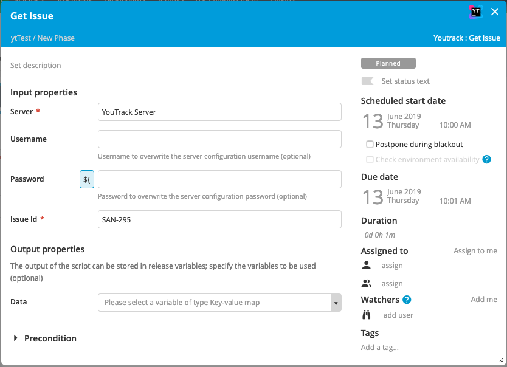
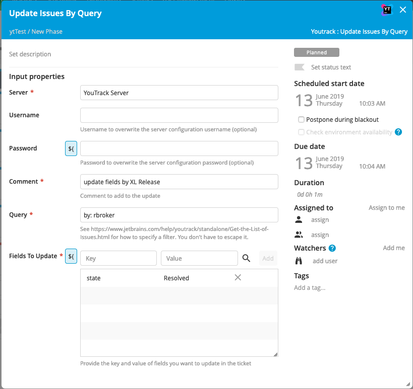
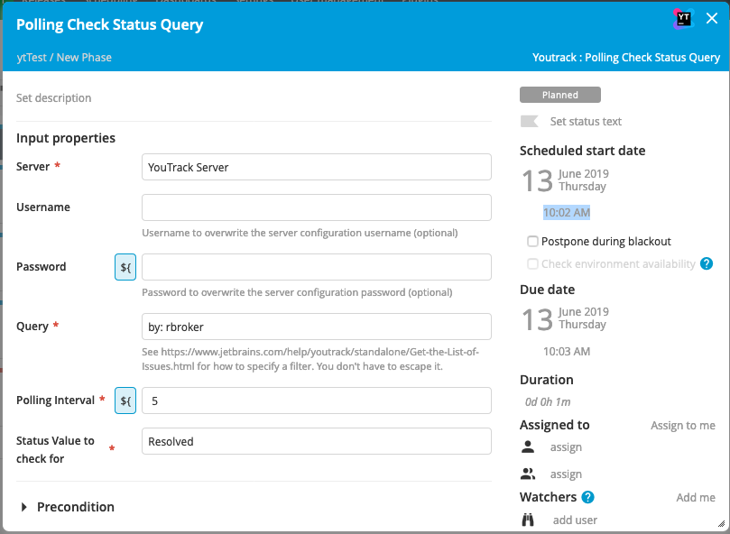
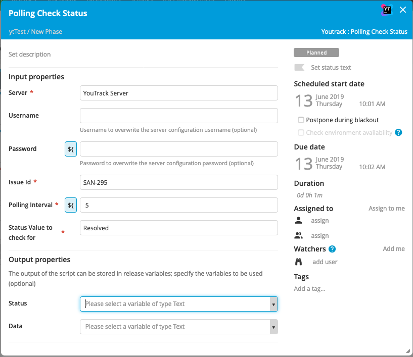
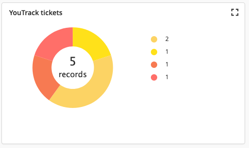
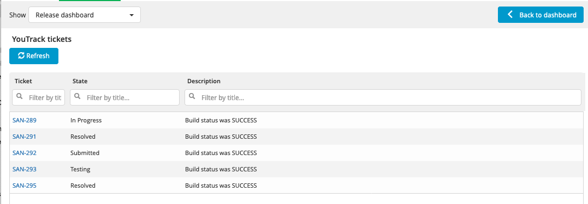

# YouTrack Integration for XL Release

[![Build Status][xlr-youtrack-plugin-travis-image]][xlr-youtrack-plugin-travis-url]

[](https://www.codacy.com/app/ndebuhr/xlr-youtrack-plugin?utm_source=github.com&amp;utm_medium=referral&amp;utm_content=xebialabs-community/xlr-youtrack-plugin&amp;utm_campaign=Badge_Grade)
[![License: MIT][xlr-youtrack-plugin-license-image]][xlr-youtrack-plugin-license-url]
[![Github All Releases][xlr-youtrack-plugin-downloads-image]][xlr-youtrack-plugin-releases-url]
[](https://github.com/RichardLitt/standard-readme)

> The YouTrack plugin enables the automated tracking and updating of YouTrack issues through XL Release

## Installation

### Requirements

1. XL Release 8.0+

### Building the plugin
The gradle wrapper facilitates building the plugin.  Use the following command to build using [Gradle](https://gradle.org/):
```bash
./gradlew clean build
```
The built plugin, along with other files from the build, can then be found in the _build_ folder.

### Adding the plugin to XL Release

Download the latest version of the plugin from the [releases page][xlr-youtrack-plugin-releases-url].  The plugin can then be installed through the graphical interface or the server backend.  For additional detail, please refer to [the docs.xebialabs.com documentation on XLR plugin installation](https://docs.xebialabs.com/xl-release/how-to/install-or-remove-xl-release-plugins.html)

### Configuration

The YouTrack server can be configured at a global level, in _Shared Configuration_, or on a finer lever (e.g. at the folder level).  Please refer to [the docs.xebialabs.com documentation on configurations](https://docs.xebialabs.com/xl-release/how-to/create-custom-configuration-types.html#configuration-page).

## Usage

Tasks included in this plugin:
### Get Issue


### Update Issues By Query


### Polling Check Status Query


### Polling Check Status


Dashboard tiles

### Graph:


### Details:


## Contributing

Please review the contributing guidelines for _xebialabs-community_ at [http://xebialabs-community.github.io/](http://xebialabs-community.github.io/)

## License

This community plugin is licensed under the [MIT license][xlr-youtrack-plugin-license-url].

See license in [LICENSE.md](LICENSE.md)

## References:
1. https://hub.docker.com/r/jetbrains/youtrack/

[xlr-youtrack-plugin-travis-image]: https://travis-ci.org/xebialabs-community/xlr-youtrack-plugin.svg?branch=master
[xlr-youtrack-plugin-travis-url]: https://travis-ci.org/xebialabs-community/xlr-youtrack-plugin
[xlr-youtrack-plugin-license-image]: https://img.shields.io/badge/license-MIT-yellow.svg
[xlr-youtrack-plugin-license-url]: https://opensource.org/licenses/MIT
[xlr-youtrack-plugin-downloads-image]: https://img.shields.io/github/downloads/xebialabs-community/xlr-youtrack-plugin/total.svg
[xlr-youtrack-plugin-releases-url]: https://github.com/xebialabs-community/xlr-youtrack-plugin/releases
